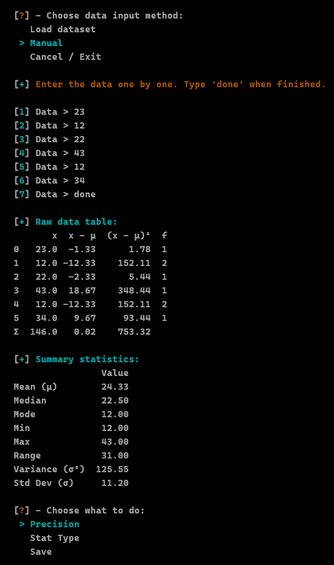
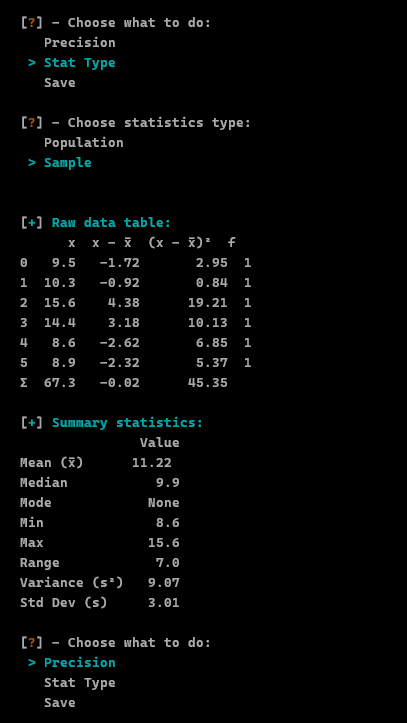

# Stats Table Generator (CLI)

<p align="center"></p>

A small Python CLI tool for generating **statistics tables** from numerical data. Designed for learning, practice, and convenience — perfect for classroom exercises or personal projects.

You can load a dataset from a CSV file or enter data manually. The program generates:

* A raw data table (with frequency, deviations, and squared deviations)  
* A summary table with mean, variance, standard deviation, and more  

Supports both **Population** and **Sample** statistics.


## Features

* Input numerical data via **CSV file** or **manual entry**  
* Display raw data tables including:
  * Values
  * Deviations from the mean
  * Squared deviations
  * Frequencies
* Compute summary statistics:
  * Mean, Median, Mode
  * Min / Max, Range
  * Variance, Standard Deviation
* Switch between **Population** and **Sample** calculations  
* Adjust **decimal precision**  
* Save results as CSV files  
* CLI navigation with **arrow keys** and **Enter** for a smoother experience  


## Requirements

* Python 3.8 or newer  
* Install dependencies via `requirements.txt`:

```bash
pip install -r requirements.txt
```
The main libraries used are:

* `pandas`
* `colorama`
* `inquirer`

## Demo

<p align="center">
  <br><br>
  <br><br>
  <br><br>
  <br><br>
  
</p>

## Quick Start (Linux / macOS / Windows)

### Linux / macOS

```bash
# Clone the repository
git clone https://github.com/RosN-11/stats-table-generator.git
cd stats-table-generator

# Install dependencies
pip3 install -r requirements.txt

# Run the program
python3 stats_table.py
```

### Windows (PowerShell / CMD)

```powershell
# Clone the repository
git clone https://github.com/RosN-11/stats-table-generator.git
cd stats-table-generator

# Install dependencies
pip install -r requirements.txt

# Run the program
python stats_table.py
```

> 💡 Notes:
>
> * **Ensure Python 3.8+ is installed**
> * **Place CSV files in the data/ folder**
> * **Use the CLI menu to select input type, view tables, change settings, and save results**


## Navigation

Use **arrow keys** and **Enter** to:
* Choose input method (CSV or Manual)
* View raw and summary tables
* Change decimal precision or calculation type
* Save result as CSV

## CSV input format

* CSV files must be inside the `data/` folder
* Numbers only (no headers required)
* Single columns only (as of now)

Example:

[View the data](data/data.csv)

| Value |
|-------|
| 9.5   |
| 10.3  |
| 15.6  |
| 14.4  |
| 8.6   |
| 8.9   |


## Limitations

* No handling for missing values (NaN)
* Large datasets may not look great in the terminal or display perfectly
* Unicode alignment may vary depending on your terminal/font


## Why I made this

This project started as a way to practice statistics and Python at the same time. It’s not meant to replace serious stats libraries — it’s just a simple, transparent tool that shows how the calculations work.


## Author

Ros N.


If you’re learning statistics or Python, feel free to use or modify the code.
